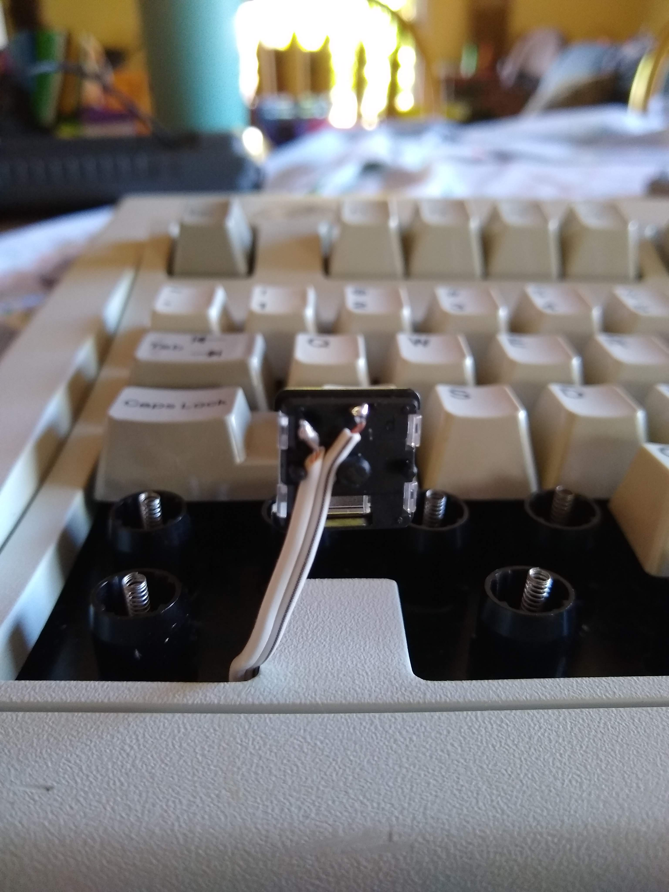

# keyboard
* Arduino sketch that works meh for windows and menu keys
    * they occasionally miss the release so ill have to make the code gooder later
* used kailh choc brown switches cause theyre low profile to sit on the plastic

## procedure
* first routed wires from around the backplate thingy so they come up out the top to the left of each missing key area
    * I used some speaker wire which was convenient because it kept the wires together and organized
    * hot glued the wires in place on the inner back board

* measured the distance needed for the keyswitches and cut the wire to length
    * the wire comes out the corner towards the front left and turns up to the switches on the key

* soldered the wires to the switches

* pulled the wires through on the back, staying out of the way of supports

* met the wires together over the hole thingy that looks like its for a speaker or something
* cut the wires to lentch to fit in the arduino
    * dont do this upside down, think gooder first

* soldered the wires into the correct pins
    * here I used pins 2 and 3 becuase they are interrupt pins and then connected the other pins to gnd
* cut a usb cable in half beyond the distance I needed to fit it in the keyboard
* my usb port was facing towards the back so I looped it 360° to go through the slots
    * in my case the usb wires bunched into a square fit perfectly through

* solder the usb wires back together and jankily electrical tape it cause you didn't buy heat shrink

* the 3-D model here supports the keyswitches so they don't wobble since they were designed to be inserted in something
    * this model leaves just enough room for the wires go go through the gap between the pegs on the side with the pins so it works alright

* at this point I just hot glue the switches on top after making sure the wires don't interfere with the keys next to it

### Next
* I need to figure out painting or somethinging logos on the keyswitches
    * definitely want a Tux the Linux penguin one
    * a windows 2.0 logo would be interesting cuase the era is roughly right, it was able to run on the ps/2
        * I guess unicomp made the model M with a windows key and it was the old like 95 looking one so maybe that if I print it or something
    * maybe the ibm p2/s logo since this was used for the ibm ps/2
        * os/2 I guess is the os it ran
